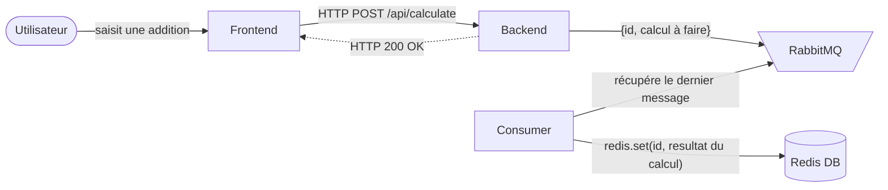
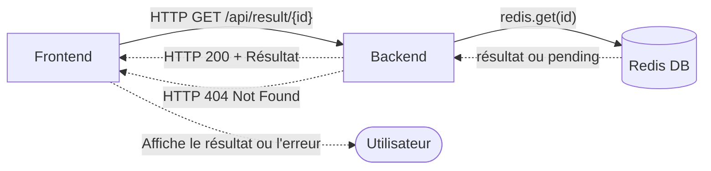

# Rapport du Projet - Calculatrice Cloud Native

## Membres du Groupe
- **GANDONOU Johanu**
- **AGONGLO Marel**

---

## Introduction

Ce projet consiste à déployer une **Calculatrice Cloud Native** en utilisant des technologies modernes de virtualisation et de cloud computing. L'application est architecturée autour de microservices, avec une infrastructure définie en code (IaC) via Terraform, et déployée sur un cluster Kubernetes. L'application permet d'effectuer des opérations mathématiques de base (addition, soustraction, multiplication, division) et stocke les résultats dans une base de données Redis. Les calculs sont gérés via une file d'attente RabbitMQ, et l'interface utilisateur est accessible via un frontend.

**Vous pouvez tester notre application en ligne ici : [calculatrice-johanu-marel.randever.com](http://calculatrice-johanu-marel.randever.com/)**

---
## Déroulé du Projet

Le projet s'est déroulé comme la mise sur le marché d'une application, à l'image du processus adopté par une équipe technique de startup. Nous avons suivi les étapes essentielles permettant de développer, déployer et rendre disponible une application à destination d'utilisateurs finaux. Ainsi, nous sommes passés par plusieurs phases clés : de la conception et le provisionnement de l'infrastructure à la définition des fichiers de déploiement, en passant par la création de l'application elle-même.

Dans une démarche inspirée des principes du Cloud Natif, nous avons mis en place de bonnes pratiques dès le départ. Cette approche nous a permis d'assurer la scalabilité, la flexibilité et la maintenance de notre infrastructure et de notre application. Parmi les pratiques adoptées, nous pouvons citer :

- **Infrastructure as Code (IaC)** : La définition de l'infrastructure a été réalisée via **Terraform**, garantissant ainsi une gestion transparente, reproductible et traçable de notre environnement.

- **Orchestration et déploiement avec Kubernetes** : L'architecture et la configuration de notre application ont été mises en place avec **Kubernetes**, permettant un déploiement cohérent, fiable et évolutif.

- **Architecture microservices** : L'application a été conçue comme une grappe de microservices interconnectés, chacun répondant à une fonction spécifique et facilitant ainsi la maintenance et les éventuelles montées en charge.

Conscients des inconvénients liés à la séparation traditionnelle entre les équipes Dev et Ops, nous avons délibérément choisi de ne pas adopter cette organisation. Au contraire, nous avons tous travaillé conjointement sur les aspects de développement et d'exploitation, favorisant ainsi la collaboration, la compréhension mutuelle et l'efficacité globale du projet.

Ce mode de fonctionnement nous a permis d'appréhender de manière plus complète les enjeux et les défis inhérents à chaque étape du cycle de vie de l'application, et d'aboutir à une solution performante, résiliente et conforme aux exigences initialement définies.

---

## Architecture de l'application

Consultez le [README - Architecture](./application/README.md) pour plus de détails.

---

## Déploiement Kubernetes

Consultez le [README - Déploiement Kubernetes](./kubernetes/README.md) pour plus de détails.

---

## Fondation de l'Infrastructure

Consultez le [README - Fondation](./foundation/README.md) pour plus de détails.

---

## Fonctionnement de l'Application

### Demande de Calcul

1. L'utilisateur saisit une opération mathématique via l'interface Frontend.
2. Le Frontend envoie une requête HTTP POST à l'API Backend.
3. L'API Backend place le calcul dans la file d'attente RabbitMQ et retourne un ID de calcul.
4. Le Consumer récupère le calcul de la file d'attente, effectue l'opération, et stocke le résultat dans Redis.

### Récupération du Résultat

1. Une fois le Frontend a reçu l'ID du calcul, il envoie une requête HTTP GET à l'API Backend.
2. L'API Backend récupère le résultat depuis Redis et le retourne au Frontend.
3. Le Frontend affiche le résultat à l'utilisateur.

---

## Conclusion

Ce projet nous a permis de mettre en pratique les concepts de virtualisation et de cloud computing, en déployant une application cloud-native sur un cluster Kubernetes. L'utilisation de Terraform pour l'infrastructure, Kubernetes pour le déploiement, et des technologies comme Redis et RabbitMQ pour la gestion des données et des files d'attente, a permis de créer une application robuste et scalable.
