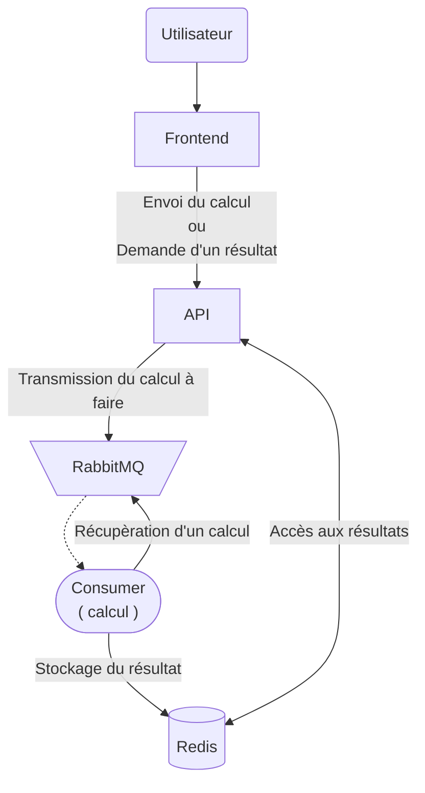

## Architecture de l'application

L'application est composée de plusieurs microservices :

1. **Frontend** : Interface utilisateur permettant de saisir des calculs et de récupérer les résultats via une API.
2. **Backend (API)** : Service qui reçoit les demandes de calculs, les place dans une file d'attente RabbitMQ, et récupère les résultats depuis Redis.
3. **Consumer** : Service qui consomme les messages de la file d'attente RabbitMQ, effectue les calculs et stocke les résultats dans Redis.
4. **Redis** : Base de données clé-valeur utilisée pour stocker les résultats des calculs.
5. **RabbitMQ** : Système de gestion de file d'attente pour gérer les calculs à effectuer.



---

## Structure de Données dans Redis

Les calculs sont stockés dans Redis sous la forme d'un objet JSON comme suit :

```json
{
  "operation_id": "resultat" // "pending" si le calcul est en cours
}
```
Explication des champs :
+ operation_id : Identifiant unique de chaque calcul.
+ resultat : Le résultat du calcul une fois effectué, ou "pending" si le calcul est en cours.
