# 🌍 Infrastructure Terraform - Fondations

Ce projet Terraform met en place l'infrastructure suivante sur Scaleway :

---

## 📊 Schéma de l’infrastructure

```mermaid
graph TD;
    subgraph PROD["🟢 Environnement Production"]
        LB_PROD["🌐 LoadBalancer Production (calculator-lb-prod)"] -->|Trafic HTTP| K8S["☸️ Cluster Kubernetes Unique (calculator-cluster)"];
        LB_PROD -->|Trafic HTTP| Redis_PROD["🛢️ Base de données Redis Production (calculator-db-prod)"];
        DNS_PROD["🌍 DNS calculatrice-marel-johanu.polytech-dijon.kiowy.net"] -->|Redirige vers| LB_PROD;
    end

    subgraph DEV["🔵 Environnement Développement"]
        LB_DEV["🌐 LoadBalancer Développement (calculator-lb-dev)"] -->|Trafic HTTP| K8S;
        LB_DEV -->|Trafic HTTP| Redis_DEV["🛢️ Base de données Redis Développement (calculator-db-dev)"];
        DNS_DEV["🌍 DNS calculatrice-dev-marel-johanu.polytech-dijon.kiowy.net"] -->|Redirige vers| LB_DEV;
    end

    Registry["📦 Namespace Conteneurs Unique (calculator-registry)"] -->|Stockage des images| K8S;

```

---

## 📌 Ressources créées

| Ressource                   | Nom généré |
|-----------------------------|--------------------------------------|
| Namespace Conteneurs        | `calculator-registry` |
| Cluster Kubernetes   | `calculator-cluster` |
| Base de données (Prod)      | `calculator-db-prod` |
| Base de données (Dev)       | `calculator-db-dev` |
| LoadBalancer (Prod)         | `calculator-lb-prod` |
| LoadBalancer (Dev)          | `calculator-lb-dev` |
| DNS Production              | `calculatrice-marel-johanu.polytech-dijon.kiowy.net` |
| DNS Développement           | `calculatrice-dev-marel-johanu.polytech-dijon.kiowy.net` |

---

## 📜 Terraform Plan Output

Terraform used the selected providers to generate the following execution plan. Resource actions
are indicated with the following symbols:
  + create

Terraform will perform the following actions:

  # scaleway_container_namespace.calculator_registry will be created
  + resource "scaleway_container_namespace" "calculator_registry" {
      + destroy_registry      = false
      + id                    = (known after apply)
      + name                  = "calculator-registry"
      + organization_id       = (known after apply)
      + project_id            = (known after apply)
      + region                = "fr-par"
      + registry_endpoint     = (known after apply)
      + registry_namespace_id = (known after apply)
    }

  # scaleway_domain_record.calculator_dns["dev"] will be created
  + resource "scaleway_domain_record" "calculator_dns" {
      + data            = (known after apply)
      + dns_zone        = "kiowy.net"
      + fqdn            = (known after apply)
      + id              = (known after apply)
      + keep_empty_zone = false
      + name            = "calculatrice-dev-marel-johanu-polytech-dijon"
      + priority        = (known after apply)
      + project_id      = (known after apply)
      + root_zone       = (known after apply)
      + ttl             = 3600
      + type            = "A"
    }

  # scaleway_domain_record.calculator_dns["prod"] will be created
  + resource "scaleway_domain_record" "calculator_dns" {
      + data            = (known after apply)
      + dns_zone        = "kiowy.net"
      + fqdn            = (known after apply)
      + id              = (known after apply)
      + keep_empty_zone = false
      + name            = "calculatrice-prod-marel-johanu-polytech-dijon"
      + priority        = (known after apply)
      + project_id      = (known after apply)
      + root_zone       = (known after apply)
      + ttl             = 3600
      + type            = "A"
    }

  # scaleway_k8s_cluster.calculator_cluster will be created
  + resource "scaleway_k8s_cluster" "calculator_cluster" {
      + apiserver_url               = (known after apply)
      + cni                         = "cilium"
      + created_at                  = (known after apply)
      + delete_additional_resources = true
      + id                          = (known after apply)
      + kubeconfig                  = (sensitive value)
      + name                        = "calculator-cluster"
      + organization_id             = (known after apply)
      + project_id                  = (known after apply)
      + region                      = "fr-par"
      + status                      = (known after apply)
      + type                        = (known after apply)
      + updated_at                  = (known after apply)
      + upgrade_available           = (known after apply)
      + version                     = "1.25.4"
      + wildcard_dns                = (known after apply)

      + auto_upgrade (known after apply)

      + autoscaler_config (known after apply)

      + open_id_connect_config (known after apply)
    }

  # scaleway_lb.calculator_lb["dev"] will be created
  + resource "scaleway_lb" "calculator_lb" {
      + id                      = (known after apply)
      + ip_address              = (known after apply)
      + ip_id                   = (known after apply)
      + ip_ids                  = (known after apply)
      + ipv6_address            = (known after apply)
      + name                    = "calculator-lb-dev"
      + organization_id         = (known after apply)
      + project_id              = (known after apply)
      + region                  = (known after apply)
      + ssl_compatibility_level = "ssl_compatibility_level_intermediate"
      + type                    = "lb-s"
      + zone                    = (known after apply)
    }

  # scaleway_lb.calculator_lb["prod"] will be created
  + resource "scaleway_lb" "calculator_lb" {
      + id                      = (known after apply)
      + ip_address              = (known after apply)
      + ip_id                   = (known after apply)
      + ip_ids                  = (known after apply)
      + ipv6_address            = (known after apply)
      + name                    = "calculator-lb-prod"
      + organization_id         = (known after apply)
      + project_id              = (known after apply)
      + region                  = (known after apply)
      + ssl_compatibility_level = "ssl_compatibility_level_intermediate"
      + type                    = "lb-s"
      + zone                    = (known after apply)
    }

  # scaleway_redis_cluster.calculator_db["dev"] will be created
  + resource "scaleway_redis_cluster" "calculator_db" {
      + certificate  = (known after apply)
      + cluster_size = 1
      + created_at   = (known after apply)
      + id           = (known after apply)
      + name         = "calculator-db-dev"
      + node_type    = "REDIS-S"
      + password     = (sensitive value)
      + project_id   = (known after apply)
      + updated_at   = (known after apply)
      + user_name    = "default_user"
      + version      = "6.2"
      + zone         = (known after apply)

      + public_network (known after apply)
    }

  # scaleway_redis_cluster.calculator_db["prod"] will be created
  + resource "scaleway_redis_cluster" "calculator_db" {
      + certificate  = (known after apply)
      + cluster_size = 1
      + created_at   = (known after apply)
      + id           = (known after apply)
      + name         = "calculator-db-prod"
      + node_type    = "REDIS-S"
      + password     = (sensitive value)
      + project_id   = (known after apply)
      + updated_at   = (known after apply)
      + user_name    = "default_user"
      + version      = "6.2"
      + zone         = (known after apply)

      + public_network (known after apply)
    }

Plan: 8 to add, 0 to change, 0 to destroy.
