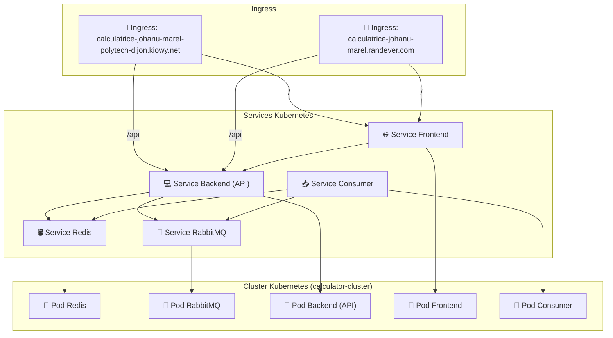

## Déploiement Kubernetes

### Fichiers de Configuration

1. **Namespace** : `01-namespace.yaml`
   - Crée un namespace dédié pour le projet : `johanu-marel`.

2. **ReplicaSets** : `02-replicasets.yaml`
   - Définit les ReplicaSets pour chaque microservice :
     - `redis-rs` : Gère le pod Redis.
     - `rabbitmq-rs` : Gère le pod RabbitMQ.
     - `backend-rs` : Gère le pod Backend (API).
     - `frontend-rs` : Gère le pod Frontend.
     - `consumer-rs` : Gère le pod Consumer.

3. **Services** : `03-services.yaml`
   - Définit les services pour exposer les pods :
     - `redis` : Expose le service Redis sur le port 6379.
     - `rabbitmq` : Expose le service RabbitMQ sur les ports 5672 (AMQP) et 15672 (Management).
     - `backend` : Expose le service Backend sur le port 5000.
     - `frontend` : Expose le service Frontend sur le port 80.

### 4. **Ingress** : `04-ingress.yaml`

Le fichier `04-ingress.yaml` définit les règles Ingress pour exposer les services Frontend et Backend via deux domaines distincts. Ces règles permettent de rediriger le trafic entrant vers les services appropriés en fonction du chemin et du domaine demandé.

#### Règles Ingress Définies

1. **Première Règle Ingress** :  
   Cette règle est conforme aux exigences du projet et utilise le domaine suivant :
   - **Domaine** : `calculatrice-johanu-marel-polytech-dijon.kiowy.net`
   - **Chemins** :
     - `/` : Redirige le trafic vers le service **Frontend** sur le port 80.
     - `/api` : Redirige le trafic vers le service **Backend** sur le port 5000.

   **Accès Local** :  
   Pour accéder à l'application via ce domaine, il est nécessaire de configurer le fichier `hosts` de votre machine pour mapper ce domaine à l'adresse IP du LoadBalancer Kubernetes. Voici comment procéder :

   - **Linux & MacOS** :
     ```bash
     sudo echo "34.77.144.136 calculatrice-johanu-marel-polytech-dijon.kiowy.net" >> /etc/hosts
     ```
   - **Windows** :
     - Ouvrez le fichier `C:\Windows\System32\drivers\etc\hosts` avec un éditeur de texte (en mode administrateur).
     - Ajoutez la ligne suivante à la fin du fichier :
       ```
       34.77.144.136 calculatrice-johanu-marel-polytech-dijon.kiowy.net
       ```

   Après cette configuration, vous pouvez accéder à l'application via un navigateur en utilisant l'URL :  
   `http://calculatrice-johanu-marel-polytech-dijon.kiowy.net`.

2. **Deuxième Règle Ingress** :  
   Cette règle a été ajoutée pour rendre l'application accessible sur Internet via notre propre serveur. Elle utilise un domaine personnalisé :
   - **Domaine** : `calculatrice-johanu-marel.randever.com`
   - **Chemins** :
     - `/` : Redirige le trafic vers le service **Frontend** sur le port 80.
     - `/api` : Redirige le trafic vers le service **Backend** sur le port 5000.

   **Accès Public** :  
   Ce domaine est configuré pour pointer vers l'adresse IP publique de notre serveur, ce qui permet d'accéder à l'application depuis n'importe où sur Internet. Aucune modification du fichier `hosts` n'est nécessaire pour ce domaine.

   Vous pouvez accéder à l'application via un navigateur en utilisant l'URL :  
   `http://calculatrice-johanu-marel.randever.com`.

---

### Pourquoi Deux Règles Ingress ?

- **Première Règle** :  
  Cette règle est conforme aux exigences du projet et permet de tester l'application localement en simulant un accès via un domaine personnalisé. Elle est utile pour les tests et les démonstrations en environnement de développement.

- **Deuxième Règle** :  
  Cette règle a été ajoutée pour rendre l'application accessible publiquement sur Internet. Elle permet de partager l'application avec d'autres utilisateurs sans qu'ils aient besoin de modifier leur fichier `hosts`.

### Schéma du Déploiement Kubernetes


